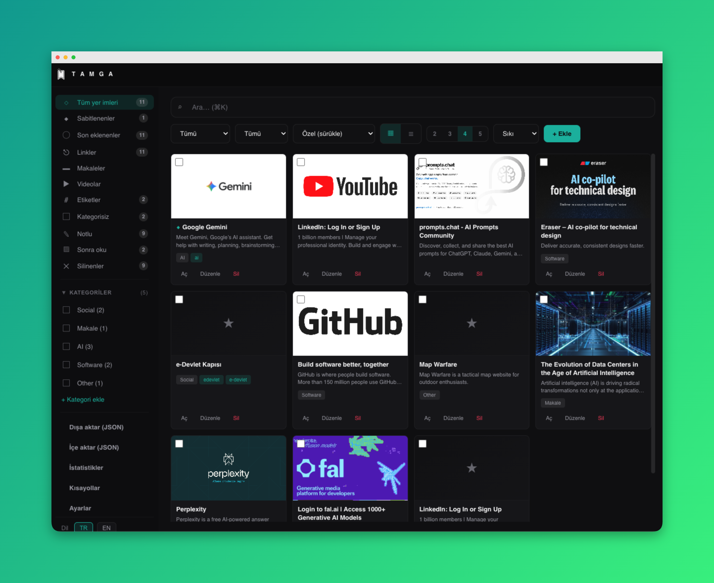

# Tamga

Tamga is a lightweight macOS menu bar bookmark manager designed for quick saving, organizing, and finding links.

## Features

- **Menu bar experience**: Access your bookmarks instantly from the top bar.
- **Smart organization**: Manage items with sections like All, Pinned, Recent, Links, Articles, Videos, Tags, Read Later, and Deleted.
- **Fast search and filtering**: Find bookmarks quickly with search, type filters, date filters, and multiple sorting options.
- **Flexible views**: Switch between card and list layouts, and adjust grid density for your preferred reading style.
- **Categories and tags**: Group bookmarks with custom categories and tags for cleaner navigation.
- **Bulk actions**: Apply category, read-later, and delete operations to multiple items at once.
- **Import & export**: Move your bookmark collection in and out easily.
- **Customizable UI**: Choose theme, accent color, and interface density.
- **Bilingual support**: Use the app in Turkish or English.
- **Extra utilities**: Built-in shortcuts panel, quick stats view, and QR generation for bookmark links.

## Installation (DMG)

1. Open the shared `.dmg` file. https://drive.google.com/file/d/110z5BZ-cWBu3Ic3PpkS_yasRHgJER9mm/view?usp=sharing
2. Drag **Tamga** into the **Applications** folder.
3. Launch Tamga from **Applications**.

If macOS shows an “Unidentified Developer” warning on first launch, open **System Settings → Privacy & Security** and choose **Open Anyway**, or right-click the app and select **Open**.
